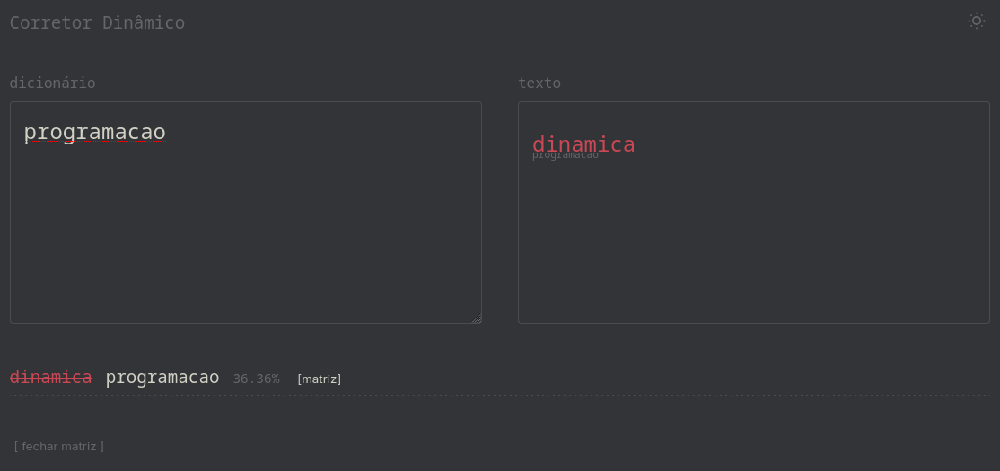
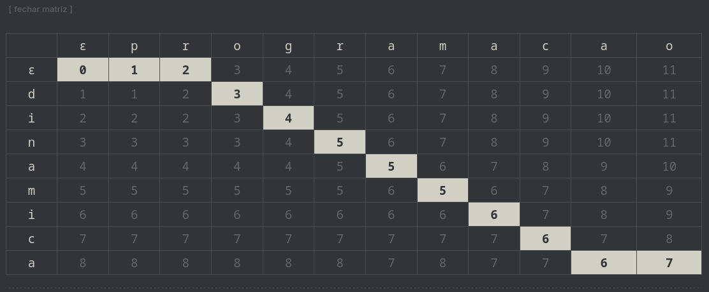
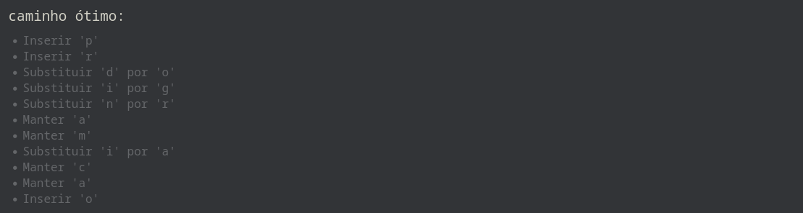

# G33_Programacao_Dinamica_PA-26.1

# Corretor Dinâmico 

*Conteúdo da Disciplina*: Programação Dinâmica<br>

## Alunos
|Matrícula | Aluno |
| -- | -- |
| 23/2014404  |  [Carlos Henrique Brasil de Souza](https://github.com/Carlos-UCH) |
| 23/2014576  |  [Yogi Nam de Souza Barbosa](https://github.com/oyogi)


## Sobre
Projeto desenvolvido por alunos da Universidade de Brasília(UnB) para a disciplina de Projeto de Algoritmos. 

O projeto consiste na utilização de Programação Dinâmica(PD) especificamente o alinhamento de sequência, para resolver o problema de correção de palavras digitadas erradas, funcionando como um corretor automático. 


## Screenshots

Comparação de palavras:



Matriz de Alinhamento de Sequência: 




Find Solution: 




## Clone o repositório  
 ```sh 
    git clone git@github.com:projeto-de-algoritmos-2026/G33_Programacao_Dinamica_PA-26.1.git
    cd G33_Programacao_Dinamica_PA-26.1
 ```

### Pre-requisitos
- Ter um navegador(Google Chrome, Firefox, Opera, etc) instalado.
- Acesso a Internet

## Uso
 - Acesse o link: https://projeto-de-algoritmos-2026.github.io/G33_Programacao_Dinamica_PA-26.1/
 - Digite a primeria palavra text-area dicionário 
 - Digite a segunda no outro text-area
 - Clique em matriz 
